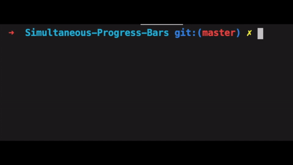

# Simultaneous Progress Bars
A simple, easy to use library to make simultaneous progress, loading bars in c++



## Instalation
1. Open a terminal and clone library wherever you desire and move there
```bash
git clone https://github.com/keybraker/Simultaneous-Progress-Bars.git && cd Simultaneous-Progress-Bars
```

2. Create library 
```bash
make lib
```

if you want to move it under root so it can be linked everywhere, type
```bash
make lib-root
```

## Usage
Linking library to you projects is done in two easy steps

1. include libloader inside a cpp file you are using it
```cpp
#include <libloader/libloader.h>
```

2. link the library when compiling
```
   g++ your_program.cpp -L/path_to_libloader -libloader
```
> note that -L is the linking flag for L_ibraries_ and what follows is the path to find it

## Demo

1. ```exp_loading_bar.cpp```

   ```bash
      make loading
   ```

  *Loading bar* _is a bar with moving dots representing progress. Percentage with elapsed time is shown and dynamically changed from seconds to minutes._

2. ```exp_progress_bar.cpp```
   
   ```bash
      make progress
   ```
   
*Progress bar* _is a bar with '=' characters increasing as process nears completion. Percentage with elapsed time is shown and dynamically changed from seconds to minutes._

3. ```exp_pingpong_bar.cpp```
   
   ```bash
      make pingpong
   ```
   
*Ping Pong* _is a table indicating processing but not percentage of completion. Percentage with elapsed time is shown and dynamically changed from seconds to minutes._
       
