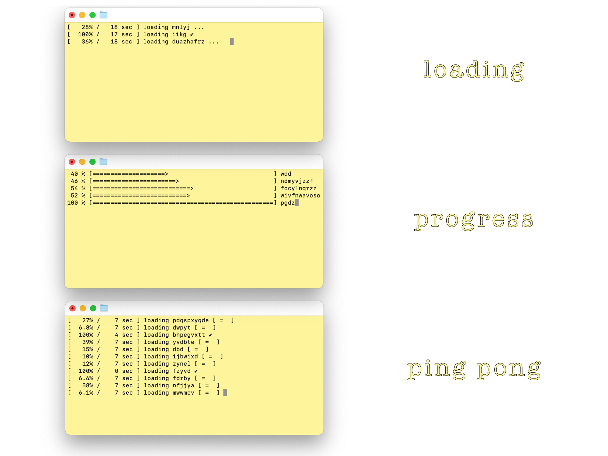

# libloader
A simple, easy to use library to make simultaneous progress, loading bars in c++



## Instalation
1. Open a terminal and clone library wherever you desire and move there
   ```bash
   git clone https://github.com/keybraker/libloader.git && cd libloader
   ```

2. Create library 
   1. use locally
   ```bash
   make lib
   ```
   2. move to root path so you can access it from anywhere
   ```bash
   make lib-root
   ```

## Usage
Linking library to you projects is done in two easy steps

1. if library is in custom path
   1. include libloader inside a cpp file you are using it: 
   ```cpp
      #include "custom_path/libloader.h"
   ```
   2. link loader library at compile time: 
   ```bash
      g++ -Wall -o loading src/exp_loading_bar.cpp -L. -lloader
   ```

2. if library is in root path 
   1. include libloader inside a cpp file you are using it: 
   ```cpp
      #include <libloader.h>
   ```
   2. ilink loader library at compile time: 
   ```bash
      g++ -Wall -o loading src/exp_loading_bar.cpp -I/usr/local/include -L/usr/local/lib -lloader
   ```

> note that -L is the linking flag for L_ibraries_ and what follows is the path to find it

## Demo

1. ```exp_loading_bar.cpp```

   ```bash
      make loading
   ```

  __Loading bar__ _is a bar with moving dots representing progress. Percentage with elapsed time is shown and dynamically changed from seconds to minutes._

2. ```exp_progress_bar.cpp```
   
   ```bash
      make progress
   ```
   
   __Progress bar__ _is a bar with '=' characters increasing as process nears completion. Percentage with elapsed time is shown and dynamically changed from seconds to minutes._

3. ```exp_pingpong_bar.cpp```
   
   ```bash
      make pingpong
   ```
   
   __Ping Pong__ _is a table indicating processing but not percentage of completion. Percentage with elapsed time is shown and dynamically changed from seconds to minutes._
       
